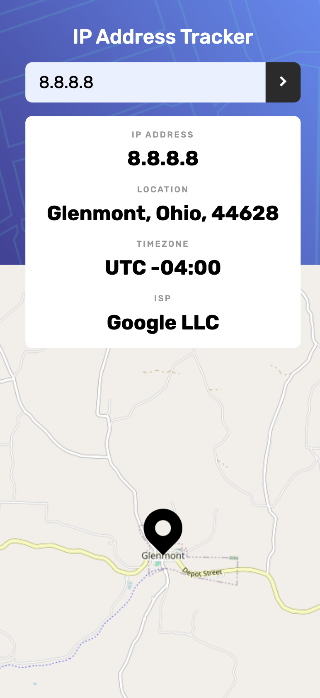

# Frontend Mentor - IP address tracker solution

This is a solution to the [IP address tracker challenge on Frontend Mentor](https://www.frontendmentor.io/challenges/ip-address-tracker-I8-0yYAH0). Frontend Mentor challenges help you improve your coding skills by building realistic projects.

## Table of contents

- [Overview](#overview)
  - [The challenge](#the-challenge)
  - [Screenshot](#screenshot)
  - [Links](#links)
- [My process](#my-process)
  - [Built with](#built-with)
  - [What I learned](#what-i-learned)
- [Author](#author)

**Note: Delete this note and update the table of contents based on what sections you keep.**

## Overview

### The challenge

Users should be able to:

- View the optimal layout for each page depending on their device's screen size
- See hover states for all interactive elements on the page
- See their own IP address on the map on the initial page load
- Search for any IP addresses or domains and see the key information and location

### Screenshot




### Links

<!-- - Solution URL: [Add solution URL here](https://your-solution-url.com) -->

- Live Site URL: [IP address tracker](https://vicschbt.github.io/PERSO-ip-address-tracker/)

## My process

### Built with

- Semantic HTML5 markup
- SCSS
- Flexbox
- CSS Grid
- Mobile-first workflow
- JavaScript
- [IP Geolocation API by IPify](https://geo.ipify.org/)
- [LeafletJS](https://leafletjs.com/)

### What I learned

The use of the `<picture>` tag in HTML, very useful to handle multiple size for the same picture.

```html
<picture>
	<source
		srcset="./assets/images/pattern-bg-desktop.png"
		media="(min-width: 450px)"
	/>
	
</picture>
```

In JS, I applied some of my last discovery in the language, the deconstructing declaration.

```js
const {
	ip,
	location: { city, region, postalCode, timezone, lat, lng },
	isp,
} = data;
```

## Author

- Frontend Mentor - [@VicSchbt](https://www.frontendmentor.io/profile/VicSchbt)
- LinkedIn - [Victoire Schubert](www.linkedin.com/in/victoire-schubert)
- Instagram - [@vicschbt.codes](https://www.instagram.com/vicschbt.codes?igsh=OHczMzcwMWpjZm1p&utm_source=qr)
